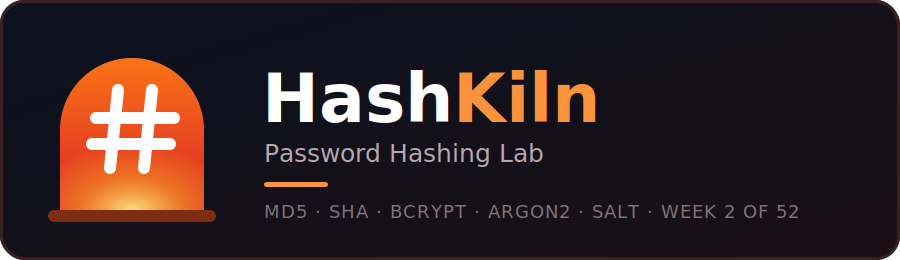

<p align="center">
  
</p>

<p align="center">
  
  
  
  
  
</p>

<p align="center">
  <b>See why MD5 is cracked in a blink, why bcrypt and Argon2 are not, and what a salt really does, all on your own computer.</b>
</p>

<p align="center">
  <a href="#-quick-start">Quick start</a> ·
  <a href="#-why-this-tool-exists">Why this exists</a> ·
  <a href="#-how-it-works">How it works</a> ·
  <a href="#-usage">Usage</a> ·
  <a href="#-learn-from-this-project">Learn</a>
</p>

---

## 📌 Table of contents
- [Why this tool exists](#-why-this-tool-exists)
- [Why a hands-on lab beats online hash tools](#-why-a-hands-on-lab-beats-online-hash-tools)
- [Features](#-features)
- [The five demos](#-the-five-demos)
- [How it works](#-how-it-works)
- [Quick start](#-quick-start)
- [Usage](#-usage)
- [Example output](#-example-output)
- [Project structure](#-project-structure)
- [Testing](#-testing)
- [Security notes and limitations](#-security-notes-and-limitations)
- [Learn from this project](#-learn-from-this-project)
- [Roadmap](#-roadmap)
- [Contributing](#-contributing)
- [Author](#-author)
- [License](#-license)

---

## 🎯 Why this tool exists

Websites get hacked. When a database is stolen, what the attacker finds depends on **how the passwords were stored**:

| Stored as | What happens after a breach |
|---|---|
| **Plain text** | Every password is instantly readable |
| **Unsalted MD5 or SHA** | Cracked in seconds with wordlists and lookup tables. Users who share a password are exposed |
| **Salted bcrypt or Argon2id** | Every guess is slow and must be repeated **per user**. Cracking strong passwords becomes impractical |

A hash is one-way: you cannot "decrypt" it. So attackers **guess**. They hash millions of common passwords and compare the results. The faster the hash, the more guesses per second, which is why **speed is a weakness** for password storage.

Most tutorials just tell you this. **HashKiln lets you watch it happen** with a benchmark, a salt demo, and a live attack on a fake stolen database.

---

## 🛡️ Why a hands-on lab beats online hash tools

Online hash generators and "hash crackers" are fine for a quick look, but they teach little about storing passwords, and pasting real passwords into websites is a risk in itself.

| Risk or gap with online tools | What can go wrong | **HashKiln (this tool)** |
|---|---|---|
| **Server logging** | A site can record every string you submit | Everything runs on your machine. Nothing is sent anywhere |
| **Cookies and browser storage** | Pages can keep your input in cookies, `localStorage` or autofill | No browser, no cookies, nothing saved |
| **Third-party scripts** | Analytics and ad scripts on the page may see what you type | No third-party code. Only `bcrypt`, `argon2-cffi` and `rich` |
| **Fake or lookalike sites** | A "hash tool" can exist only to collect passwords | You can read every line of the source |
| **They show fast hashes only** | You never see how salts, work factors and memory-hard hashing change the result | Fast and slow hashes side by side, with real timings |
| **No attack, no consequence** | Generating a hash does not show why it matters | A live dictionary attack on a fake database shows exactly why |
| **Nothing to learn from** | Black-box page, no explanation | Every demo ends with a plain-English lesson, plus exercises |

> **Honest note:** many online hash tools run entirely in your browser and are harmless. The advantage here is that you can **audit the code**, you never need to paste a real password anywhere, and the lab teaches the part generators skip: how passwords should actually be **stored**.

---

## ✨ Features

- 🔬 **Hash explorer** with the avalanche effect (MD5, SHA-1, SHA-256, SHA-512)
- ⏱️ **Speed benchmark**: guesses per second and "time to try 1 billion guesses"
- 🧂 **Salt demo**: shared passwords, where the salt lives, lookup-table attacks
- 💥 **Dictionary attack** on a fake stolen database, with a live progress bar
- 🔑 **Sign-up and login simulator** that shows what a website really stores
- ✅ **Safe settings**: Argon2id (19 MiB, 2 iterations, 1 thread) and bcrypt cost 12
- 🧭 **Guided tour** or pick one demo from a menu
- 🔌 **Works offline**: no internet, no API key
- 🧪 **19 automated tests**

---

## 🧪 The five demos

| # | Demo | What you learn |
|---|---|---|
| 1 | **Hash explorer & avalanche effect** | Same input gives the same hash. Change one character and about half of the bits flip |
| 2 | **Speed benchmark** | MD5 and SHA-256 against bcrypt and Argon2id: guesses per second |
| 3 | **Salt demo** | Identical passwords give identical unsalted hashes. Salted hashes differ and defeat lookup tables |
| 4 | **Dictionary attack** | Same attacker, same wordlist, three storage methods. Watch MD5 fall and slow hashes hold |
| 5 | **Sign-up & login simulator** | What a site stores and how it checks your password |

---

## 🔬 How it works

**The two families of hashes**

```
  FAST hashes                          SLOW, SALTED hashes
  MD5, SHA-1, SHA-256, SHA-512         bcrypt, Argon2id
  built for speed                      built for passwords
  attacker: billions of guesses/sec    attacker: a handful of guesses/sec
  ❌ never for passwords               ✅ the right tool
```

**How a login check works**

```
 SIGN UP                                   LOG IN
 ───────                                   ──────
 you type a password                       you type a password
        │                                         │
 add a random SALT                         fetch the stored salt + hash
        │                                         │
 hash it (Argon2id / bcrypt)               hash what you typed using that salt
        │                                         │
 store salt + hash ONLY                    compare in constant time
 (real password thrown away)                      │
                                           match = access granted
```

**How the attack demo works**

```
 stolen database  +  wordlist of common passwords
        │
        ▼
 for each guess: hash it ──► compare with the stolen hashes
        │
        ├─ unsalted MD5   : hash each guess ONCE, check every user at the same time
        └─ salted bcrypt / Argon2id : re-hash each guess PER USER, and each hash is slow
```

> The salt is **not secret**. It is stored inside the hash string. Its job is to make every hash unique so one guess cannot crack many accounts.

---

## 🚀 Quick start

You need **Python 3.10 or newer**. Check with `python --version`.

**1. Download the project**
```bash
git clone https://github.com/RavinduChamika1/hashkiln.git
cd hashkiln
```

**2. Create and activate a virtual environment**
```bash
python -m venv .venv

# Windows (Command Prompt)
.venv\Scripts\activate
# Windows (PowerShell)
.venv\Scripts\Activate.ps1
# Mac / Linux
source .venv/bin/activate
```

**3. Install the libraries**
```bash
pip install -r requirements.txt
```

**4. (Optional) Run the tests**
```bash
pytest
```
Expect `19 passed`.

**5. Run it**
```bash
python src/cli.py
```

---

## 💻 Usage

```bash
python src/cli.py                    # interactive menu
python src/cli.py --run all          # guided tour of demos 1-4
python src/cli.py --run benchmark    # one demo: explorer | benchmark | salt | attack | login
python src/cli.py --fast             # shorter timings and no "press Enter" pauses
python src/cli.py --help             # show all options
```

**What happens when you run it**

1. A menu lists the five demos and a guided tour
2. You pick one and read the result and the plain-English lesson
3. You return to the menu, or exit with `0`

**Tip:** in the login simulator the password prompt is hidden, so nothing appears while you type. This is normal.

---

## 📺 Example output

**Speed benchmark** (your numbers will differ)
```text
╭──────────────────┬───────────────┬─────────────────────────┬─────────────────┬───────────────────╮
│ Algorithm        │ Guesses / sec │ Speed                   │          vs MD5 │ 1 billion guesses │
├──────────────────┼───────────────┼─────────────────────────┼─────────────────┼───────────────────┤
│ MD5              │     964,959.2 │ ███████████████████████ │        baseline │      17.3 minutes │
│ SHA-256          │     886,979.7 │ ███████████████████████ │  about the same │      18.8 minutes │
│ bcrypt (cost 12) │           3.6 │ ██                      │ 270,571x slower │         8.9 years │
│ Argon2id         │          22.9 │ █████                   │  42,175x slower │         1.4 years │
╰──────────────────┴───────────────┴─────────────────────────┴─────────────────┴───────────────────╯
```

**Dictionary attack on a fake stolen database**
```text
╭────────────────────────┬──────────────────┬───────────────┬─────────────┬────────────────────────╮
│ Storage method         │ Accounts cracked │ Guesses / sec │  Time taken │ Outcome                │
├────────────────────────┼──────────────────┼───────────────┼─────────────┼────────────────────────┤
│ Unsalted MD5           │       4/4        │       102,524 │      0.5 ms │ Whole database cracked │
│ Salted bcrypt (cost 12)│       0/4        │             4 │ 2.5 seconds │ Attacker ran out of time│
│ Salted Argon2id        │       0/4        │            27 │ 2.5 seconds │ Attacker ran out of time│
╰────────────────────────┴──────────────────┴───────────────┴─────────────┴────────────────────────╯
```

*Python on one CPU core measures far fewer guesses per second than a real attacker's GPUs. The huge gap between fast and slow hashes is the point.*

*(Add your own screenshot or demo GIF here, for example `assets/demo.gif`.)*

---

## 🗂️ Project structure

```
hashkiln/
├── assets/
│   ├── logo.svg          # banner (vector)
│   └── logo.png          # banner shown in this README
├── src/
│   ├── cli.py            # menu and program flow
│   ├── algorithms.py     # MD5, SHA, bcrypt, Argon2id wrappers
│   ├── explorer.py       # demo 1: hash explorer and avalanche effect
│   ├── benchmark.py      # demo 2: speed benchmark
│   ├── salt_demo.py      # demo 3: salts
│   ├── attack_demo.py    # demo 4: dictionary attack on a fake database
│   ├── login_sim.py      # demo 5: sign-up and login simulator
│   ├── samples.py        # fake users and the common-password wordlist
│   ├── ui.py             # shared look and feel
│   └── about.py          # author and copyright details
├── tests/
│   └── test_hashing.py   # 19 offline tests
├── labs/
│   ├── LAB.md            # student exercises
│   └── solutions/
├── LEARN.md
├── requirements.txt
├── pytest.ini
├── LICENSE
└── README.md
```

---

## 🧪 Testing

```bash
pytest
```

The tests check, among other things:
- known MD5 and SHA-256 test values
- the avalanche effect (about 50% of bits change)
- bcrypt and Argon2id accept the right password and reject wrong ones
- salts differ between hashes of the same password
- bcrypt refuses passwords over 72 bytes
- slow hashes are far slower than MD5
- the attack demo respects its time limit
- the real password is never stored

---

## 🔒 Security notes and limitations

- **Educational tool.** The attack demo only targets hashes this program creates from fake users. Never attack accounts or data you do not own.
- The settings used (Argon2id with 19 MiB memory, 2 iterations, 1 thread; bcrypt cost 12) follow OWASP's published guidance at the time of writing. **Check the current [OWASP Password Storage Cheat Sheet](https://cheatsheetseries.owasp.org/cheatsheets/Password_Storage_Cheat_Sheet.html) before using any numbers in a real system.**
- bcrypt only uses the first 72 bytes of a password. Longer input is rejected with a clear message.
- Passwords typed into the login simulator are hashed, kept in memory only, and gone when the program exits.
- Benchmark numbers come from Python on one CPU core. Real attackers use GPUs that are much faster against MD5 and SHA.
- Good hashing does not rescue a weak password. Use long, unique passwords and a password manager.
- A tool like this does not replace a proper security review of a real application.

**Disclaimer:** this project is for education and personal use only.

---

## 📚 Learn from this project

Open [LEARN.md](LEARN.md) for the key concepts: hash functions, fast vs slow hashes, salts, work factors, how login works, and upgrading old hashes. Then try the exercises in [labs/LAB.md](labs/LAB.md).

---

## 🗺️ Roadmap

Part of **52 Weeks of Security**: one new cybersecurity project every week.

- [x] **Week 1:** [PassVigil](https://github.com/RavinduChamika1/passvigil), password strength and breach checker
- [x] **Week 2:** HashKiln, password hashing lab
- [ ] **Week 3:** Phishing URL analyzer
- [ ] More coming every week

Ideas for this project: add scrypt or PBKDF2 to the benchmark, a larger wordlist option, a cost-versus-time chart.

---

## 🤝 Contributing

Contributions are welcome.

1. Fork the repository
2. Create a branch: `git checkout -b feature/your-idea`
3. Make your changes and run `pytest`
4. Commit and push, then open a Pull Request

Found a bug or have an idea? [Open an issue](https://github.com/RavinduChamika1/hashkiln/issues).

---

## 👤 Author

**Ravindu Chamika**

[](https://www.linkedin.com/in/ravindu-chamika/)
[](https://github.com/RavinduChamika1)

If this helped you learn something, please ⭐ the repo and follow the series.

---

## 📄 License

Copyright © 2026 **Ravindu Chamika**. Released under the [MIT License](LICENSE).

<p align="center"><sub>Built for cybersecurity students · 52 Weeks of Security · Week 2</sub></p>
